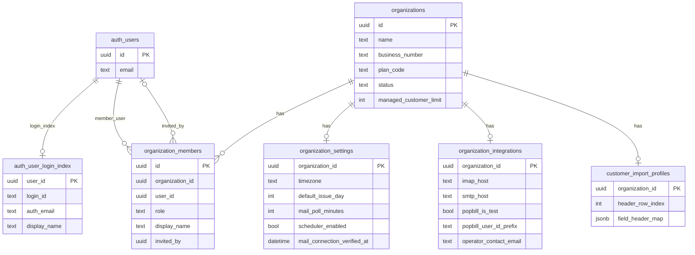
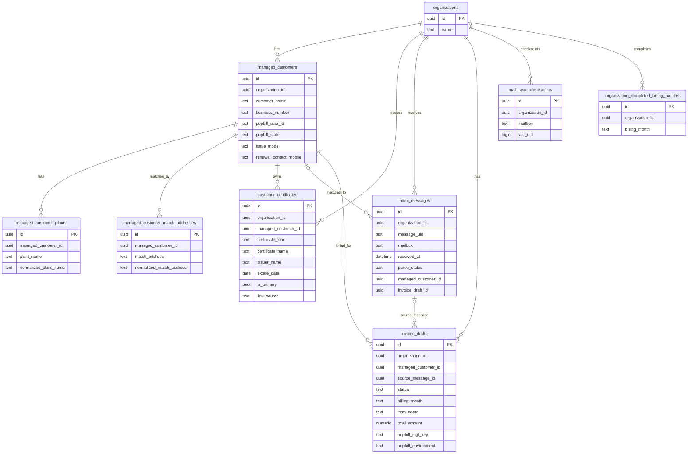
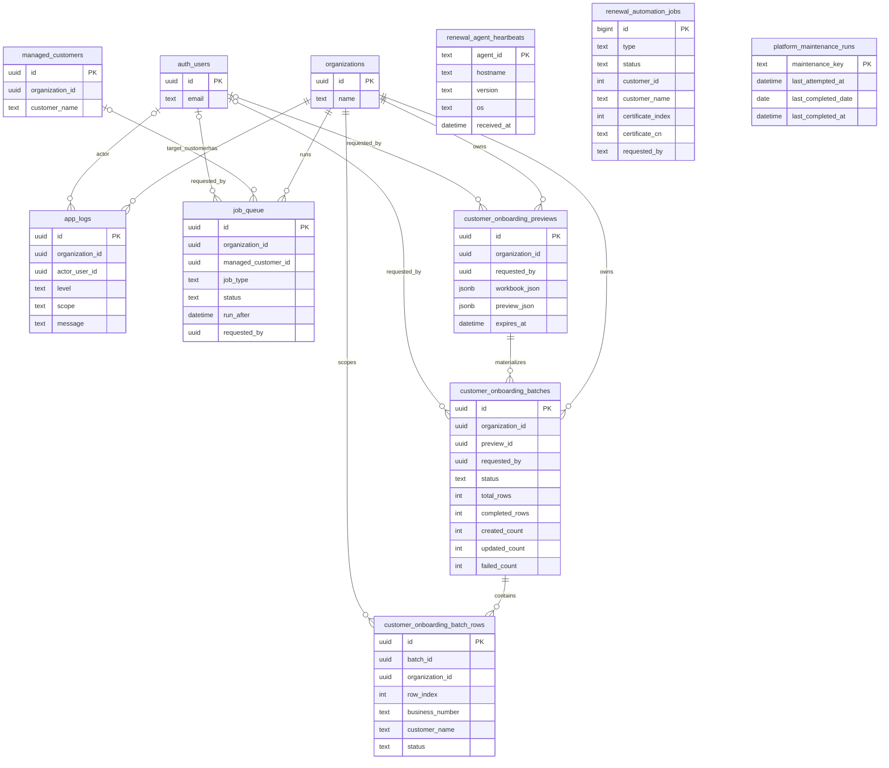

# AUTO-TAX ERD Draft

This ERD draft is derived from the current Supabase migrations in `supabase/migrations/`
through `20260414130000_add_customer_onboarding_batches.sql`.

Conventions:

- `auth_users` is a stand-in for Supabase `auth.users`.
- For readability, many timestamps, `legacy_id`, encrypted secrets, and large JSON fields are omitted.
- `renewal_automation_jobs.customer_id` is a legacy numeric reference, not a foreign key.
- `inbox_messages` and `invoice_drafts` are conceptually paired, but the schema currently uses optional pointers rather than a strict 1:1 constraint.

## 1. Workspace / Auth / Settings

## 2. Customer / Mail / Billing Flow

## 3. Onboarding / Operations

## Notes

- `managed_customer_match_addresses` is the canonical customer auto-match table.
- `managed_customer_plants` is supplemental display/reference data, not the primary match key.
- `customer_certificates` is the only customer-level certificate table with an actual foreign key to `managed_customers`.
- `renewal_agent_heartbeats`, `renewal_automation_jobs`, and `platform_maintenance_runs` are operational tables; only the first two are renewal-helper-specific.
- `renewal_automation_jobs.customer_id` is intentionally left unconnected in the ERD because it is not a real FK to `managed_customers.id`.
- Several tables also carry `legacy_id bigint` fields for compatibility; they are omitted here to keep the diagram readable.
