# AUTO-TAX Sitemap

이 문서는 **목표 IA 기준의 사이트맵**이다.

기준:

- `인증서`는 `설정`과 분리된 별도 운영 화면
- `ops`는 일반 사용자 제품이 아니라 플랫폼 관리자 백오피스
- 따라서 **사용자용 사이트맵**과 **관리자용 사이트맵**을 분리해서 본다

관련 문서:

- `docs/FEATURE_LIST.md`
- `docs/WIREFRAME_ERD.md`
- `docs/PRODUCT_RESHAPE_PLAN.md`

---

## 1. 사용자용 사이트맵

```mermaid
flowchart TD
  A[앱 셸] --> B[홈]
  A --> C[고객]
  A --> D[인증서]
  A --> E[설정]
  A --> F[도입 준비]

  B --> B1[오늘 할 일]
  B --> B2[긴급 예외]
  B --> B3[검토 후 발행 큐]
  B --> B4[최근 수신]
  B --> B5[최근 발행 결과]

  C --> C1[고객 리스트]
  C --> C2[고객 상세]
  C2 --> C21[기본 정보 탭]
  C2 --> C22[발행 준비 상태]
  C2 --> C23[주소 매칭 규칙]
  C2 --> C24[발행 이력 탭]
  C --> C3[고객 등록/수정]

  D --> D1[인증서 현황 리스트]
  D --> D2[필터: 조치 필요/미연결/만료 임박/결제 가능]
  D --> D3[행 인라인 확장 상세]
  D --> D4[고객 연결]
  D --> D5[연결 해제]
  D --> D6[갱신 준비]
  D --> D7[결제 열기]

  E --> E1[메일 연결]
  E --> E2[발행 설정]
  E --> E3[헬퍼 상태]
  E --> E4[계정/작업공간]
  E4 --> E41[내 비밀번호 변경]
  E4 --> E42[멤버 관리]

  F --> F1[1. 메일 연결]
  F --> F2[2. 발행 기본값]
  F --> F3[3. 로컬 헬퍼 준비]
  F --> F4[4. 고객 초기 등록]
  F --> F5[5. 인증서 연결 마무리]
  F --> F6[6. 첫 메일 동기화]
  F --> F7[7. 미매칭 메일 예외 처리]
  F --> F8[8. 첫 발행 확인]
```

---

## 2. 관리자용 사이트맵 (`ops`)

---

## 3. 공개 사이트맵

---

## 4. 화면 계층 설명

## 4-1. 홈

역할:

- 오늘 처리할 일의 출발점
- 우선순위가 높은 예외를 먼저 보여주는 운영 대시보드

하위 정보:

- 긴급 예외
- 검토할 초안
- 최근 수신 메일
- 최근 발행 결과

연결:

- 고객
- 인증서
- 도입 준비

## 4-2. 고객

역할:

- 고객 단위로 문제를 해결하는 핵심 운영 화면

구조:

- 좌측 리스트
- 우측 상세
- 상세 내부 액션

하위 정보:

- 기본 정보
- 팝빌 상태
- 인증서 상태
- 주소 매칭 규칙
- 발행 이력 탭

결정:

- 고객 상세는 `기본 정보`와 `발행 이력`을 탭으로 분리한다

## 4-3. 인증서

역할:

- 인증서 관련 액션을 모아두는 별도 작업 공간

하위 정보:

- 헬퍼 연결 상태
- 인증서 목록
- 연결 상태
- 갱신 준비 / 결제 가능 상태
- 행 인라인 확장 상세

주요 액션:

- 연결
- 연결 해제
- 갱신 준비
- 결제 열기

결정:

- 인증서 상세는 우측 고정 패널이 아니라 **리스트 행 인라인 확장 방식**으로 본다

## 4-4. 설정

역할:

- 작업공간의 기본값과 계정을 관리

하위 섹션:

- 메일 연결
- 발행 설정
- 헬퍼 상태
- 계정 / 작업공간

제외:

- 실제 인증서 리스트 작업은 여기 두지 않는다

헬퍼 상태 최소 범위:

- 연결 여부
- 버전
- 업데이트/재설치 필요 여부
- 마지막 확인 시각
- 읽은 인증서 수
- 상태 새로고침
- 인증서 화면 이동

## 4-5. 도입 준비

역할:

- 첫 발행까지의 가이드형 화면

구조:

- 진행률 hero
- 단계 strip
- 현재 단계 본문

하위 단계:

1. 메일 연결
2. 발행 기본값
3. 로컬 헬퍼 준비
4. 고객 초기 등록
5. 인증서 연결 마무리
6. 첫 메일 동기화
7. 미매칭 메일 예외 처리
8. 첫 발행 확인

---

## 5. 추천 메뉴 순서

메인 사용자용:

1. 홈
2. 고객
3. 인증서
4. 설정
5. 도입 준비

보조/권한 조건부:

6. 관리자 (`ops`)

의도:

- **홈 → 고객 → 인증서**는 일상 운영 흐름
- **설정 → 도입 준비**는 셋업/보조 흐름
- `ops`는 메인 제품이 아니라 분리된 백오피스

---

## 6. 라우팅/구현 메모

현재 구현상 참고:

- 메인 탭은 `home / customers / settings / onboarding / ops`
- 현재는 `settings` 안에 인증서 작업대가 함께 렌더링됨
- 목표 IA는 `certificates`를 별도 탭/화면으로 분리하는 방향

구현 원칙:

- `settings`는 헬퍼 상태 요약만 사용하고
- 인증서 리스트/연결/갱신 액션은 `certificates`로 분리 가능한 구조를 유지한다

즉, 이 사이트맵은 **현재 구현 복사본**이 아니라 **앞으로의 목표 구조**다.

---

## 7. 와이어프레임 우선순위

먼저 그릴 화면:

1. 앱 셸
2. 홈
3. 고객 리스트 + 상세
4. 인증서
5. 설정
6. 도입 준비

나중에 확장:

1. 공개 랜딩 상세
2. 관리자 ops
3. 고객 상세 내 세부 이력 화면
