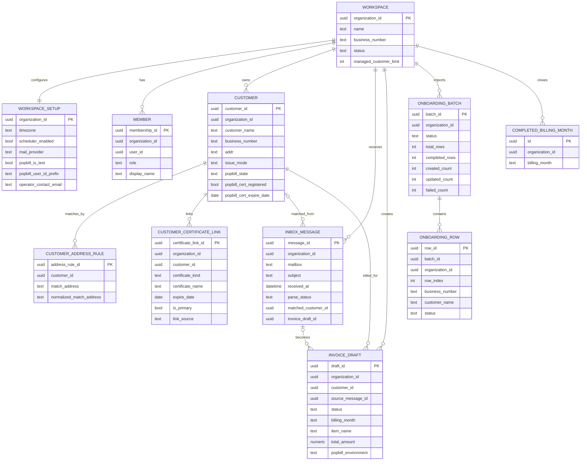
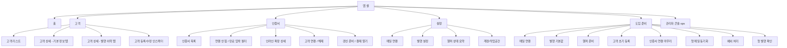

# AUTO-TAX Wireframe ERD

이 문서는 **DB 설계용 정밀 ERD**가 아니라, **와이어프레임 설계용 논리 ERD**입니다.

즉 기준이 다릅니다.

- 포함: 사용자가 화면에서 직접 보고/수정/판단하는 정보
- 축소: 운영 로그, 내부 큐, 유지보수용 테이블
- 목적: 화면 구조, 리스트/상세/단계 흐름, 주요 상태를 빠르게 잡기

기술 스키마 원본은 `docs/ERD.md`, `docs/SUPABASE_SCHEMA_PLAN.md`, `supabase/migrations/`를 봅니다.

이 문서는 **합의된 목표 IA** 기준으로 정리합니다.

- `인증서`는 `설정` 내부 작업대가 아니라 **별도 운영 화면**
- `ops`는 일반 사용자 화면이 아니라 **플랫폼 관리자 전용 백오피스**
- 따라서 1차 사용자용 와이어프레임은 `홈 / 고객 / 인증서 / 설정 / 도입 준비`를 중심으로 봅니다.

참고:

- 현재 구현은 `설정` 화면 안에 인증서 작업대가 함께 렌더링되지만,
- **와이어프레임 목표 구조는 분리된 `인증서` 화면**입니다.
- 설정은 **헬퍼 상태 요약만**, 인증서 실무 작업은 **별도 화면**으로 유지합니다.

---

## 1. 와이어프레임 기준 핵심 논리 엔터티

아래 엔터티는 실제 물리 테이블을 화면 설계 관점으로 묶은 것입니다.

| 논리 엔터티 | 실제 소스 테이블 | 화면에서 보이는 핵심 값 | 주로 쓰는 화면 |
|---|---|---|---|
| `WORKSPACE` | `organizations` | 작업공간명, 상태, 관리 고객 한도 | 홈, 설정, 관리자 |
| `WORKSPACE_SETUP` | `organization_settings`, `organization_integrations` | 메일 연결, 발행 기본값, 담당자 연락처, 스케줄러, 팝빌 모드 | 설정, 도입 준비 |
| `MEMBER` | `organization_members` | 사용자 이름, 역할, 초대/관리 상태 | 설정 |
| `CUSTOMER` | `managed_customers` | 고객명, 사업자번호, 주소, 발행 방식, 팝빌 연결 상태, 인증서 만료 상태 | 고객, 홈, 도입 준비 |
| `CUSTOMER_ADDRESS_RULE` | `managed_customer_match_addresses` | 매칭 주소 | 고객 상세, 예외 메일 처리 |
| `CUSTOMER_CERTIFICATE_LINK` | `customer_certificates` | 인증서 종류, 만료일, 주 인증서 여부, 연결 출처 | 인증서, 고객 |
| `INBOX_MESSAGE` | `inbox_messages` | 수신일시, 제목, 파싱 상태, 예외 여부, 연결 고객 | 홈, 도입 준비(예외 처리) |
| `INVOICE_DRAFT` | `invoice_drafts` | 발행 상태, 정산월, 품목, 금액, 소스 메일 | 홈, 고객 상세, 첫 발행 확인 |
| `ONBOARDING_BATCH` | `customer_onboarding_previews`, `customer_onboarding_batches` | 업로드 결과, 진행률, 생성/갱신 수, 경고/실패 | 도입 준비, 초기 등록 |
| `ONBOARDING_ROW` | `customer_onboarding_batch_rows` | 행 상태, 대상 사업자번호, 실패 사유 | 도입 준비, 초기 등록 |
| `COMPLETED_BILLING_MONTH` | `organization_completed_billing_months` | 완료 처리한 정산월 | 도입 준비(예외 처리) |

와이어프레임에서는 `managed_customer_plants` 같은 보조 데이터는 별도 엔터티보다 **고객 상세 내부의 참고 정보**로 다루는 편이 낫습니다.

---

## 2. 와이어프레임용 축약 ERD

### 해석 포인트

- **홈 화면의 중심**은 `INBOX_MESSAGE` + `INVOICE_DRAFT`
- **고객 화면의 중심**은 `CUSTOMER` + `CUSTOMER_CERTIFICATE_LINK` + `CUSTOMER_ADDRESS_RULE`
- **인증서 화면의 중심**은 `CUSTOMER_CERTIFICATE_LINK` + `CUSTOMER`
- **설정 화면의 중심**은 `WORKSPACE_SETUP` + `MEMBER`
- **도입 준비의 중심**은 `ONBOARDING_BATCH` + `ONBOARDING_ROW` + `INBOX_MESSAGE`

---

## 3. 화면-엔터티 매핑

## 3-1. 앱 레벨 화면

| 화면 | 목적 | 주 엔터티 | 비고 |
|---|---|---|---|
| 홈 (`home`) | 오늘 처리할 일, 초안, 최근 수신, 최근 발행 확인 | `INBOX_MESSAGE`, `INVOICE_DRAFT`, `CUSTOMER` | 운영 대시보드 성격 |
| 고객 (`customers`) | 고객 상태 점검, 신규 등록, 발행 준비 해결 | `CUSTOMER`, `CUSTOMER_CERTIFICATE_LINK`, `CUSTOMER_ADDRESS_RULE`, `INVOICE_DRAFT` | 리스트 + 상세 + 발행 이력 탭 구조 |
| 인증서 (`certificates`) | 인증서 읽기, 연결/해제, 만료/갱신/결제 작업 | `CUSTOMER_CERTIFICATE_LINK`, `CUSTOMER` | 별도 운영 작업 공간, 상세는 인라인 확장 |
| 설정 (`settings`) | 메일/발행/헬퍼/계정 설정 | `WORKSPACE_SETUP`, `MEMBER` | 헬퍼 상태 요약만 남기고 실제 인증서 작업은 제외 |
| 도입 준비 (`onboarding`) | 초도 세팅과 첫 운영 흐름 가이드 | `WORKSPACE_SETUP`, `ONBOARDING_BATCH`, `CUSTOMER`, `INBOX_MESSAGE`, `INVOICE_DRAFT` | 단계형 wizard |
| 관리자 (`ops`) | 플랫폼 관리자 전용 운영 화면 | 별도 운영 엔터티 | 사용자 제품 IA와 분리된 백오피스 |

## 3-2. 도입 준비 단계별 매핑

현재 앱의 도입 준비는 실제로 아래 8단계입니다.

| 단계 | UI 목적 | 핵심 엔터티 |
|---|---|---|
| 1. 메일 연결 | IMAP/SMTP 연결 테스트 | `WORKSPACE_SETUP` |
| 2. 발행 기본값 입력 | 팝빌/담당자/스케줄 설정 | `WORKSPACE_SETUP` |
| 3. 로컬 헬퍼 준비 | 공동인증서 읽기 준비 | `WORKSPACE_SETUP` + 로컬 헬퍼 상태(뷰 모델) |
| 4. 고객 초기 등록 | 엑셀 업로드, 미리보기, 반영 | `ONBOARDING_BATCH`, `ONBOARDING_ROW`, `CUSTOMER` |
| 5. 인증서 연결 마무리 | 고객-인증서 연결/등록 마감 | `CUSTOMER`, `CUSTOMER_CERTIFICATE_LINK` |
| 6. 첫 메일 동기화 | 실제 메일 읽기 시작 | `INBOX_MESSAGE`, `INVOICE_DRAFT` |
| 7. 미매칭 메일 예외 처리 | 고객 빠른 등록, 주소 예외 처리 | `INBOX_MESSAGE`, `CUSTOMER`, `CUSTOMER_ADDRESS_RULE`, `COMPLETED_BILLING_MONTH` |
| 8. 첫 발행 확인 | 검토할 초안 / 발행 결과 확인 | `INVOICE_DRAFT`, `INBOX_MESSAGE`, `CUSTOMER` |

---

## 4. 와이어프레임 1차 구조안

와이어프레임은 **“스크린 수를 줄이고, 한 화면 안에서 해결해야 하는 흐름을 명확히”** 잡는 게 중요합니다.

추천 1차 구조는 아래입니다.

### 화면별 추천 레이아웃

#### 1) 앱 셸

- 좌측 사이드바
  - 홈
  - 고객
  - 인증서
  - 설정
  - 도입 준비
  - 관리자(플랫폼 관리자만)
- 상단 액션바
  - 현재 작업공간
  - 현재 화면 제목
  - 핵심 CTA 1개
  - 상태 chip

#### 2) 홈

- 상단: 오늘 할 일 / 막힘 / 고객 / 최근 결과 요약 chip
- 1열 우선순위 블록
  - 예외 메일
  - 인증서 주의
  - 중복 의심
- 메인 패널 2개
  - 검토 후 발행 큐
  - 최근 수신 / 최근 발행 feed

#### 3) 고객

- 좌측: 고객 필터 + 고객 리스트
  - 전체 / 막힘 / 만료 / 연결 / 발행 가능
- 우측: 고객 상세
  - 탭: 기본 정보 | 발행 이력
  - 기본 정보 탭 안에
    - 주소 매칭 규칙
    - 팝빌 상태 / 인증서 상태
    - 다음 조치 버튼
  - 발행 이력 탭 안에
    - 발행 이력
    - 관련 초안

#### 4) 설정

- 좌측: 준비 상태 사이드바
  - 메일 연결
  - 발행 설정
  - 헬퍼 상태
  - 계정 / 작업공간
- 우측: 선택 섹션 상세
  - 폼 + 자동 저장 상태
  - 헬퍼 상태는 요약형만 유지
    - 연결 여부
    - 버전
    - 업데이트/재설치 필요 여부
    - 마지막 확인 시각
    - 읽은 인증서 수
    - 인증서 화면 이동 버튼

#### 5) 인증서

- 상단: 헬퍼 연결 상태 / 읽은 인증서 수 / 액션 버튼
- 좌측 또는 상단 필터
  - 전체
  - 연결 안 됨
  - 만료 임박
  - 결제 가능
- 메인 리스트
  - 인증서명
  - 종류
  - 만료일
  - 연결 고객
  - 상태
  - 다음 조치
- 각 행은 인라인 확장 가능
  - 추천 고객
  - 고객 연결
  - 연결 해제
  - 갱신 준비
  - 결제 열기

#### 6) 도입 준비

- 상단 hero
  - 진행률
  - 지금 할 일
  - 막힌 이유
- 단계 strip
  - 1~8단계
- 본문
  - 현재 단계 카드 1개만 크게
  - 각 단계는 “입력 → 검토 → 실행 → 완료” 흐름 유지

---

## 5. 와이어프레임 우선순위

처음부터 모든 화면을 그리기보다, 아래 순서로 그리면 빠릅니다.

### 1차로 꼭 그릴 화면

1. 앱 셸
2. 홈
3. 고객 리스트 + 고객 상세
4. 인증서
5. 설정(메일 연결 / 발행 설정)
6. 도입 준비 wizard
7. 고객 초기 등록 단계
8. 예외 메일 처리 단계

### 2차로 확장할 화면

1. 첫 발행 확인 화면
2. 관리자(`ops`) 화면

---

## 6. 와이어프레임에서 일부러 약하게 다뤄도 되는 것

아래는 DB에는 중요하지만, 1차 와이어프레임에서는 비중을 낮춰도 됩니다.

- `app_logs`
- `job_queue`
- `renewal_agent_heartbeats`
- `renewal_automation_jobs`
- `platform_maintenance_runs`
- `auth_user_login_index`
- 대부분의 `legacy_id`
- 내부 JSON 원문(`parsed_data`, `result_json`, `preview_json` 전체 구조)

즉, **운영 내부 구조보다 “사용자가 지금 뭘 보고, 뭘 눌러서, 다음 상태로 가는가”**를 먼저 그리는 게 맞습니다.

추가로:

- `ops`는 사용자용 제품 흐름이 아니라 **플랫폼 관리자 백오피스**
- 따라서 메인 제품 IA와 관리자 IA는 분리해서 그리는 편이 좋습니다.
- `settings`와 `certificates`는 IA뿐 아니라 구현 경계도 분리 가능한 구조로 유지합니다.

---

## 7. 다음 추천 산출물

이 문서를 바탕으로 바로 이어서 만들기 좋은 것은 아래 3개입니다.

1. **화면별 Low-fi 와이어프레임 목록**
2. **페이지별 필수 컴포넌트 체크리스트**
3. **사용자 플로우 다이어그램**  
   - 첫 도입 플로우
   - 일일 운영 플로우
   - 예외 처리 플로우
